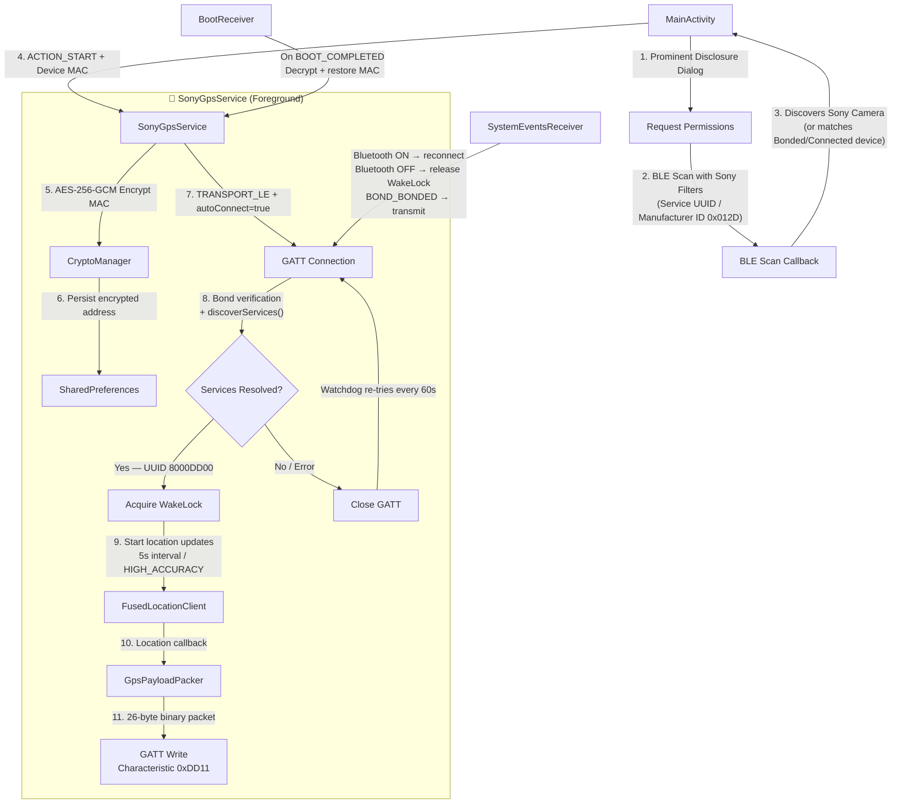
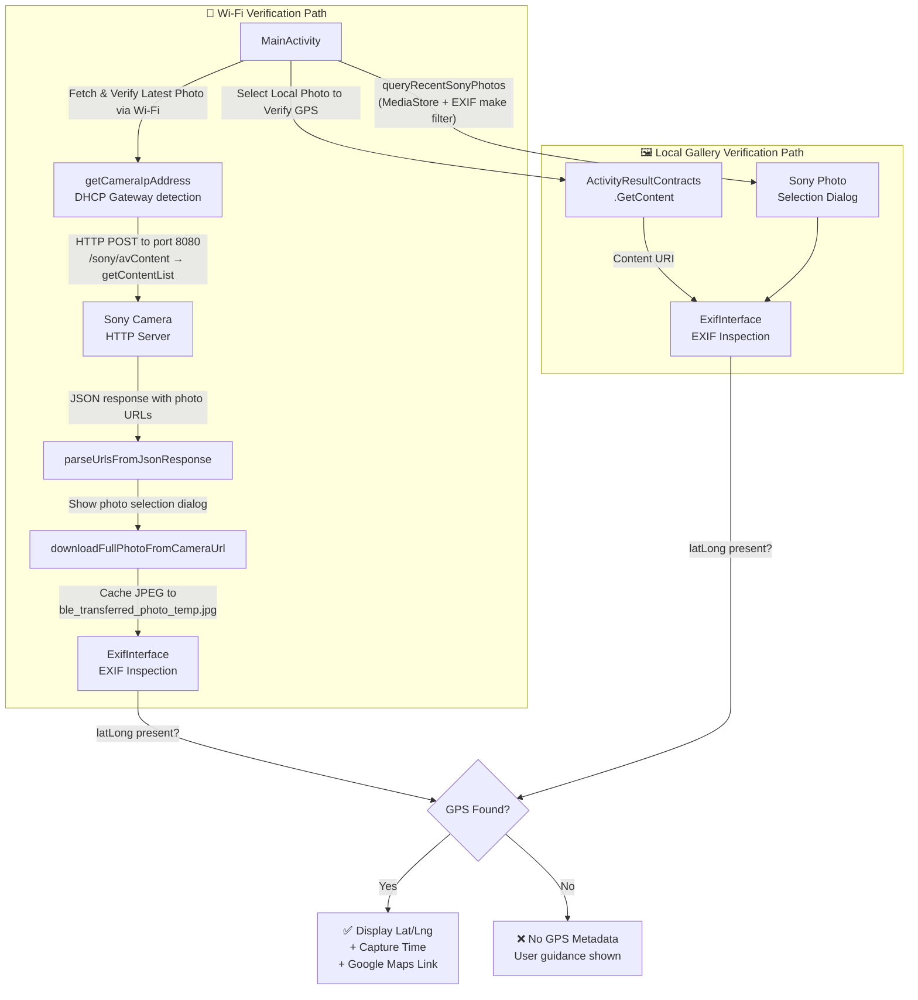

# Sony Camera BLE Geotagger

A premium, highly secure, and battery-optimized Android client designed to push high-precision GPS telemetry from your Android device to a paired Sony camera over Bluetooth Low Energy (BLE). This enables automatic, seamless geotagging of photos in real-time. The app also includes a built-in Wi-Fi photo verification tool to confirm that GPS EXIF metadata was successfully embedded in your shots.

---

## 🌟 Key Features

*   **⚡ Zero Background Battery Drain**: Deferrals prevent GPS chips and CPU cores from waking up when the camera is powered off. High-accuracy location telemetry and system `WakeLocks` are strictly engaged *only* when a secure GATT linkage with the camera is established.
*   **🔌 Native Low-Power BLE autoConnect**: Utilizes Android's hardware-level BLE scan filters (`autoConnect = true`). The OS handles reconnection logic directly in the Bluetooth radio chip without needing custom, battery-intensive background polling loops.
*   **🔋 Sticky Lifecycle & Boot Resilience**: Implements an automatic `BootReceiver` that hooks into `BOOT_COMPLETED` system events to seamlessly restart the service and re-establish camera connection after phone reboots.
*   **🔒 Hardened Data-at-Rest Security**: The paired camera's MAC address is encrypted using AES-256-GCM via the Android Keystore before writing to `SharedPreferences`, preventing raw identifier harvesting on rooted devices.
*   **🛡️ Overlay Tapjacking Protection**: Activates system-level obscuration filters (`filterTouchesWhenObscured = true`) on the UI parent layout container to protect users from permission Clickjacking/Tapjacking overlay attacks.
*   **🤝 Google Play Store Publishing Compliant**: Integrates an elegant, prominent background location disclosure dialog before requesting `ACCESS_BACKGROUND_LOCATION` to satisfy Google Play Console regulations. Sandbox backups are disabled (`allowBackup = false`) to block local ADB data extractions.
*   **📸 Wi-Fi Photo GPS Verification**: Connects directly to the Sony camera's built-in HTTP server over Wi-Fi (port 8080) to browse and download photos from the SD card, then inspects their EXIF metadata to confirm GPS coordinates were successfully embedded.
*   **🖼️ Local Gallery EXIF Inspector**: Lets users select any photo from their local gallery to instantly verify whether it carries GPS EXIF tags, with a direct Google Maps link generated from the embedded coordinates.

---

## 📐 System Architecture

The application is composed of two independent operational flows: the **BLE GPS Geotagging** flow and the **Photo Verification** flow.

### Flow 1 — BLE GPS Geotagging



### Flow 2 — Photo GPS Verification



---

## 📂 Project Directory Structure

```
.
├── AndroidManifest.xml    # App configurations, permissions, and component declarations
├── BootReceiver.kt        # BroadcastReceiver for auto-restarting the service on device boot
├── CryptoManager.kt       # AES-256-GCM encryption/decryption via Android Keystore
├── GpsPayloadPacker.kt    # Serialization utility building the 26-byte binary GPS command payload
├── MainActivity.kt        # UI, permission handler, BLE scanner, and photo verification tools
└── SonyGpsService.kt      # Foreground service managing BLE GATT connection and GPS sync
```

---

## 🛠️ Setup & Compilation Requirements

To integrate these files into a standard Android Studio project, configure your module-level `build.gradle` (or `build.gradle.kts`) with the following settings:

### Android SDK Target
*   **`minSdk`**: 23 (Android 6.0 Marshmallow)
*   **`compileSdk` / `targetSdk`**: 34 (Android 14)

### Dependencies
```groovy
dependencies {
    implementation 'androidx.appcompat:appcompat:1.6.1'
    implementation 'androidx.core:core-ktx:1.12.0'
    implementation 'androidx.exifinterface:exifinterface:1.3.7'
    implementation 'com.google.android.gms:play-services-location:21.0.1'
}
```

---

## 🛡️ Security & Privacy Protocols

The app operates under strict defense-in-depth protocols:
1.  **AES-256-GCM Encryption**: Camera MAC addresses are encrypted via the Android Keystore system (`CryptoManager`) using AES/GCM/NoPadding with hardware-backed key storage before being written to `SharedPreferences`. A legacy XOR/Base64 cipher is used as a silent fallback for migrating older stored values.
2.  **Isolated Components**: The background service is declared with `android:exported="false"` to prevent inter-app injection.
3.  **Protected Broadcasts**: The `BootReceiver` is bound to the `android.permission.RECEIVE_BOOT_COMPLETED` permission, ensuring only the OS can trigger system re-initializations.
4.  **Secure Logcat**: Explicit latitude and longitude data along with target camera MAC addresses are obfuscated or filtered inside active diagnostic logging paths.
5.  **No Plain-Text Storage**: AES-256-GCM ciphers with randomized IVs protect sandboxed preferences from static XML file reads on rooted devices.
